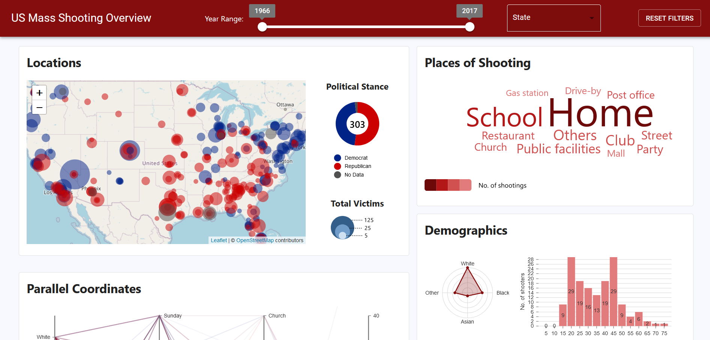
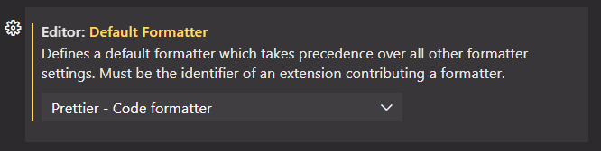
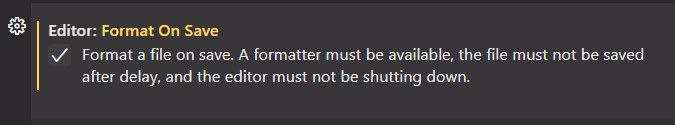

# US Mass Shooting Data Visualization

## About

This is the group project for the course "COMP4462 - Data Visualization" (2021 Fall).

Contributors:

- [owen-hwlee](https://github.com/owen-hwlee) - Front-end dashboard
- [AnsonH](https://github.com/AnsonH) - Front-end dashboard
- [thomas-chong](https://github.com/thomas-chong) - Data preprocessing and NLP

This dashboard that visualizes data of US mass shooting events from 1966~2017. We obtained the dataset from [Kaggle](https://www.kaggle.com/zusmani/us-mass-shootings-last-50-years).



The Jupyter notebooks that contain the data preprocessing code can be found in the `src/data` directory.

## Development

```bash
# 1. Clone the project
git clone https://github.com/owen-hwlee/comp4462-project-gp1.git
cd comp4462-project-gp1/

# 2. Install `yarn` (am alternative package manager to npm) if you haven't
npm install -g yarn

# 3. Install dependencies
yarn

# 4. Start the local development server
npm start
```

### Yarn

This project uses [Yarn](https://yarnpkg.com/) as the package manager instead of NPM (Node Package Manager) because Yarn has faster performance than NPM.

> ⚠️ Use the `yarn add XXXX` command ([documentation](https://classic.yarnpkg.com/lang/en/docs/cli/add/)) instead of `npm install XXXX` command when you wish to install new dependencies in the future.

## Deploying to GitHub Pages

To deploy the website to GitHub Pages, run the following command:

```bash
npm run deploy
```

## Prettier

This project uses [Prettier](https://prettier.io/) to format your code files, ensuring that the entire codebase has a consistent code format. The `.prettierrc` file at the root of the repo contains several format options ([visit this link](https://prettier.io/docs/en/options.html) to learn more about available format options).

If you wish Prettier to format every code file of the repo in one go, run `npm run format`.

### Auto-Formatting in VS Code

If you are using VS Code, you can use Prettier to auto format your code files during save:

1. Open VS Code and go to the "Extensions" tab in the sidebar
2. Install the [Prettier extension](https://marketplace.visualstudio.com/items?itemName=esbenp.prettier-vscode)
3. Open VS Code Settings via "Ctrl + ,"
4. Search for "Editor: Default Formatter" and set to "Prettier - Code formatter":
   
5. Next, search for "Editor: Format On Save" and tick the checkbox
   
6. Prettier will now auto-format your `.js`, `.jsx`, and `.md` files

### Auto-Formatting For Staged Changes

To ensure that all your staged changes are formatted by Prettier before committing them, this project uses the following packages:

- [`husky`](https://www.npmjs.com/package/husky/v/4.3.8) - Run scripts automatically every time you make a commit
- [`lint-staged`](https://www.npmjs.com/package/lint-staged) - Run Prettier to format only the staged changes when you make a commit

This automatically works once you finished setting up your project for local development.
